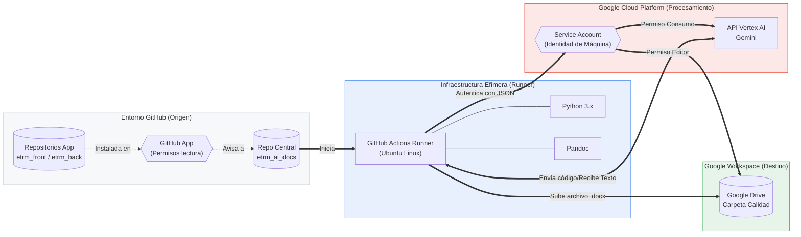

```mermaid
flowchart LR
    %% Bloque GitHub
    subgraph GH ["Entorno GitHub (Origen)"]
        R1[("Repositorios App<br/>etrm_front / etrm_back")] 
        R2[("Repo Central<br/>etrm_ai_docs")]
        App{{"GitHub App<br/>(Permisos lectura)"}}
        
        R1 -.->|Instalada en| App
        App -.->|Avisa a| R2
    end
    %% Bloque Ejecución
    subgraph CI ["Infraestructura Efímera (Runner)"]
        Runner["GitHub Actions Runner<br/>(Ubuntu Linux)"]
        P1[Python 3.x]
        P2[Pandoc]
        
        Runner --- P1
        Runner --- P2
    end
    %% Bloque Google Cloud
    subgraph GCP ["Google Cloud Platform (Procesamiento)"]
        SA{{"Service Account<br/>(Identidad de Máquina)"}}
        Vertex["API Vertex AI<br/>Gemini"]
    end
    %% Bloque Google Workspace
    subgraph GW ["Google Workspace (Destino)"]
        Drive[("Google Drive<br/>Carpeta Calidad")]
    end
    %% Conexiones de Arquitectura
    R2 ==>|Inicia| Runner
    Runner ==>|Autentica con JSON| SA
    SA ==>|Permiso Consumo| Vertex
    Runner <==>|Envía código/Recibe Texto| Vertex
    SA ==>|Permiso Editor| Drive
    Runner ==>|Sube archivo .docx| Drive
    %% Estilos
    style GH fill:#f6f8fa,stroke:#d0d7de
    style CI fill:#e8f0fe,stroke:#4285f4
    style GCP fill:#fce8e6,stroke:#ea4335
    style GW fill:#e6f4ea,stroke:#34a853
```
